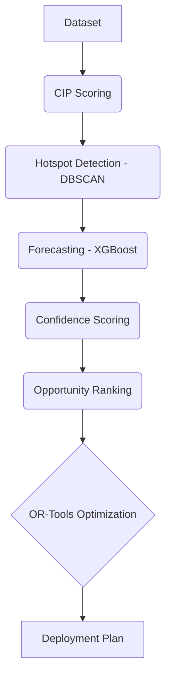

# ParkSight AI
  <h3>AI-Driven Parking Intelligence for Congestion-Aware Targeted Enforcement</h3>
  
  <p>
    Built on <b>298,450 Bengaluru Traffic Police parking violation records</b>, ParkSight AI is a data-driven decision support system that identifies high-impact parking hotspots, predicts future congestion risk, ranks enforcement opportunities, and optimizes officer deployment using Machine Learning and Operations Research.
  </p>
</div>

---

## Key Features

- Congestion Impact Potential (CIP) : Scoring framework for evaluating the real impact of violations.
- Hotspot Intelligence : Spatial hotspot discovery using DBSCAN clustering.
- Predictive Forecasting : Junction-level congestion forecasting using XGBoost & Moving Averages.
- Confidence Scoring : Data reliability and consistency validation.
- Opportunity Ranking : Engine for targeted, high-impact enforcement.
- Resource Optimization : Google OR-Tools CP-SAT for constraint-based deployment planning.
- Analytics Dashboard : Station-level performance analytics and coverage-efficiency analysis.

---

## Technology Stack

**Frontend Command Center**<br/>


**Backend Core**<br/>


**Machine Learning & Optimization**<br/>


---

## System Architecture & Engines

| Engine | Endpoint | Description |
|--------|----------|-------------|
| **M0 — Data Validation** | `GET /api/summary` | Dataset quality checks, filtering statistics, and validation reporting. |
| **M1 — Hotspot Intelligence** | `GET /api/hotspots` | Spatial hotspot discovery using DBSCAN clustering & density analysis. |
| **M2 — CIP Engine** | `GET /api/cip` | Computes congestion impact scores (weighted violation, vehicle type, time-of-day). |
| **M3 — Forecasting Engine** | `GET /api/forecast` | Forecasts future junction risk using XGBoost & Moving Averages. |
| **M4 — Confidence Engine** | `GET /api/confidence` | Generates confidence scores based on historical consistency & data density. |
| **M5 — Opportunity Engine** | `GET /api/opportunities` | Ranks enforcement opportunities (`Opportunity Score = Predicted CIP × Confidence Score`). |
| **M6 — Resource Planning** | `POST /api/plan/resource` | OR-Tools CP-SAT optimization to maximize congestion reduction under budget. |
| **M6b — Target Planning** | `POST /api/plan/target` | Determines minimum officer-hours required to achieve target coverage. |
| **M7 — Station Efficiency** | `GET /api/stations` | Station-level productivity and enforcement effectiveness metrics. |
| **M8 — Coverage Analysis** | `GET /api/coverage` | Identifies staffing knee-points and diminishing-return regions. |

---

## Machine Learning & Optimization Pipeline



### CIP Formula
> `CIP = vehicle_weight × violation_weight × time_weight × multi_violation_factor`

---

## Quick Start

### 1. Backend Setup
```bash
cd backend
pip install -r requirements.txt
uvicorn app:app --reload
```
API Documentation (Swagger UI): [http://localhost:8000/docs](http://localhost:8000/docs)

### 2. Frontend Command Center
Enterprise dark-theme command-center UI with sidebar navigation, live API integration, Leaflet maps, and Recharts visualizations.

```bash
cd frontend
npm install
npm run dev
```
Dashboard Access: [http://localhost:5173](http://localhost:5173) *(Proxies API to backend)*

---

## 📂 Project Structure

```text
flipkart/
├── backend/                  # FastAPI backend
│   ├── app.py                # FastAPI entry point
│   ├── requirements.txt      # Python dependencies
│   ├── routes/               # API endpoints
│   ├── schemas/              # Pydantic validation schemas
│   ├── services/             # Core business logic & engines
│   ├── models/               # Data models
│   ├── data/                 # Raw/Processed datasets
│   ├── trained_models/       # ML Models
│   └── utils/                # Utility scripts & helpers
├── frontend/                 # React dashboard (Vite + Tailwind)
│   ├── package.json          # Node dependencies
│   ├── tailwind.config.js    # Tailwind configuration
│   ├── vite.config.js        # Vite configuration
│   └── src/
│       ├── api/              # Axios API client
│       ├── components/       # Reusable UI components
│       ├── lib/              # Helper libraries/utilities
│       ├── pages/            # Dashboard pages
│       ├── store/            # Zustand global state
│       ├── App.jsx           # Root React component
│       └── main.jsx          # React entry point
└── README.md                 # Project documentation
```

---

## Future Enhancements

- Real-time traffic camera integration
- Explainable AI (SHAP) for decision transparency
- Live officer deployment recommendations & mobile app
- City-wide congestion simulation
- Multi-city scalability
